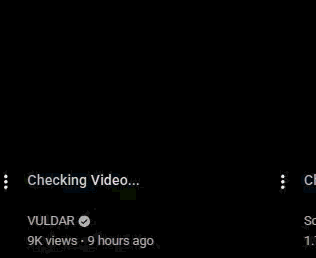

# YouTube Content Filter (Chrome Extension)

  
  
  

YouTube video card filtering for topic-based content blocking.

  &emsp; 
  &emsp;Checks video before displaying. Shows video only if it's not related to any blacklisted topics. 

## Highlights

- Topic-based blocking with comma-separated rules (for example: `crypto, gambling, gossip`).
- Titles and media remain hidden while checks are pending.
- Visual verification for approved videos.
- Coverage for YouTube Home and Watch-page recommendation surfaces.
- Usage telemetry in Options (titles processed, LLM calls, token estimates, estimated spend).

## Installation & Configuration

1. Open `chrome://extensions`.
2. Enable **Developer mode**.
3. Click **Load unpacked**.
4. Select this repository folder.
5. Open extension **Details** -> **Extension options**.
6. Enter your OpenAI API key.
7. Set blocked topics as a comma-separated list.
8. Save settings.

> [!NOTE]
> Model selection is currently fixed to `gpt-4o-mini` in the UI.

## Security and Data Handling

- API key is stored in Chrome extension storage on your local profile.
- Title text is sent to OpenAI for classification.
- No external backend is required for core operation.

